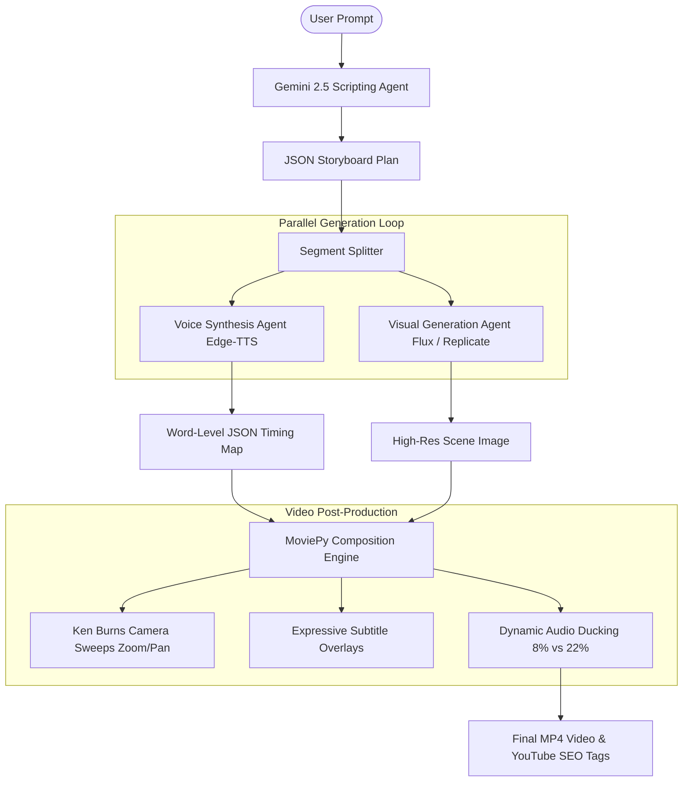

# ImagineIf Factory 🎬

An end-to-end AI agent pipeline that automates the generation of speculative, high-retention YouTube Shorts and videos from a single text concept.

Designed as an AI-powered assistant for content creators, it generates scripts, creates context-aware visual scenes, builds expressive voice narration, synchronizes word-level subtitles, and auto-mixes background audio with cinematic transitions.

---

## 🚀 Key Features

*   **Gemini 2.5 Scripting & Storyboarding**: Automatically designs a full scene-by-scene script using structured JSON schemas and curated visuals.
*   **Varied Ken Burns Camera Sweeps**: Applies randomized zoom-in, zoom-out, pan-left, and pan-right motions to prevent repetitive slideshow aesthetics.
*   **Dynamic Audio Ducking**: Auto-mixes background tracks by ducking music to `8%` during voice narration and boosting it to `22%` during speech pauses and scene transitions.
*   **Expressive Word-Level Captions**: Subtitles highlight the active spoken word in real-time, coloring words dynamically to indicate questions, excitement (`!`), or pauses (`...`).
*   **Safety Staggering**: Staggers asset generation requests to guarantee high success rates and prevent rate limits under credit-constrained API environments.
*   **Single-Segment Editor (Credit Saver)**: Allows creators to modify individual storyboard cells and regenerate *only* that cell's audio or image in-place, preserving API quotas.

---

## 🛠️ System Architecture



---

## ⚙️ Setup & Installation

### 1. Prerequisites
Ensure you have **Python 3.10+** installed. You will also need active API keys for:
*   [Google Gemini API](https://aistudio.google.com/)
*   [Replicate API](https://replicate.com/)

### 2. Installation
1.  Clone the repository:
    ```bash
    git clone https://github.com/sheta-darshan/ImagineIf-Factory.git
    cd ImagineIf-Factory
    ```
2.  Create and activate a virtual environment:
    ```bash
    python -m venv .venv
    # On Windows:
    .venv\Scripts\activate
    # On macOS/Linux:
    source .venv/bin/activate
    ```
3.  Install the required dependencies:
    ```bash
    pip install -r requirements.txt
    ```

### 3. Environment Variables
Create a file named `.env` in the root directory:
```env
GEMINI_API_KEY=your_gemini_api_key_here
REPLICATE_API_TOKEN=your_replicate_api_token_here
```

### 4. Running the Application
Launch the FastAPI development server:
```bash
python main.py
```
Open your browser and navigate to `http://127.0.0.1:8000`.

---

## 🎨 Course Concepts Applied
This capstone project implements several key concepts taught in Kaggle's AI Agents course:
1.  **Multi-Agent Coordination**: Splits video building into dedicated task-specialists (storyboard agent, image generation agent, voice synthesis agent, and video composition editor).
2.  **Antigravity Collaboration**: Built, refined, and tested interactively with the Antigravity pair-programming agent workspace.
3.  **Local Dev & Security**: Utilizes isolated `.env` context to safeguard keys and applies staggered task queue throttling.
